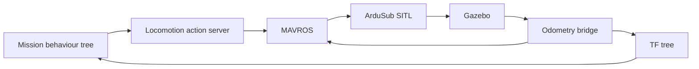

# BlueROV example architecture

The BlueROV examples connect mission logic to ArduSub through ROS 2:



## Layers

| Layer                    | Responsibility                                    |
| ------------------------ | ------------------------------------------------- |
| Mission tree             | Chooses actions, searches, and recovery paths     |
| Pose conversion          | Resolves body and anchor-frame goals into map ENU |
| Locomotion action server | Publishes MAVROS setpoints and checks progress    |
| MAVROS                   | Translates ROS messages to MAVLink                |
| ArduSub and Gazebo       | Runs vehicle control and simulated physics        |
| Odometry bridge          | Returns vehicle pose through MAVROS and TF        |

Bin and torpedo demos split these layers across tmux panes: `sim`,
`controls`, `cluster`, `vision`, and `bt`. Each pane can be restarted
independently.

## Conventions

- Mission body offsets use FLU: `+x` forward, `+y` left, `+z` up.
- Map poses use ENU, so depth below the surface has negative z.
- `move_rel`, `depth_rel`, and `heading_rel` are independent.
- MAVROS position setpoints publish at 1 Hz.
- Mission trees tick at 10 Hz.
- Use `memory=True` on mission `Sequence` and `Selector` nodes.
- Run TF- and pose-clustering nodes with simulated time.
- Keep the vehicle URDF and Gazebo SDF aligned.

## Anchor frames

A movement goal can align a vehicle-mounted frame instead of `base_link`.
The bin demo uses the dropper; the torpedo demo uses the left or right
shooter. The pose-conversion service applies the offset before the goal is
sent to controls.

## First checks when something fails

```bash
ros2 topic echo /mavros/state --once
ros2 topic echo /mavros/local_position/pose --once
ros2 topic echo /bluerov/odom --once
ros2 action list | grep controls
ros2 service list | grep convert_to_controls_pose
```

- No MAVROS connection: check ArduSub and host networking.
- No local position: check the odometry bridge and EKF input.
- Clustering reports no samples: check that the pose estimator is publishing
  the requested TF or pose topic.
- The robot moves the wrong way: check FLU/ENU signs and relative flags.
